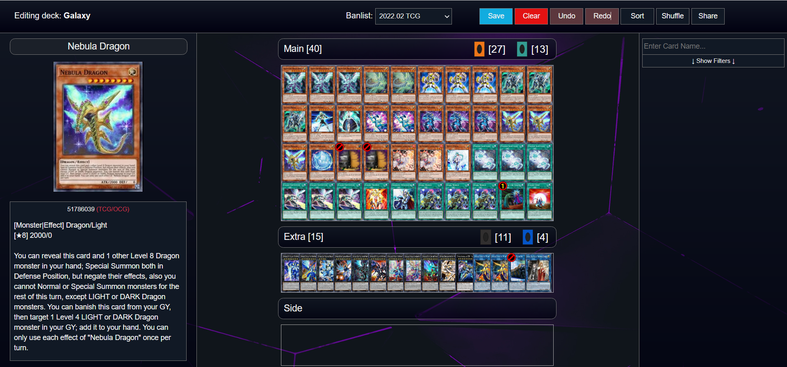
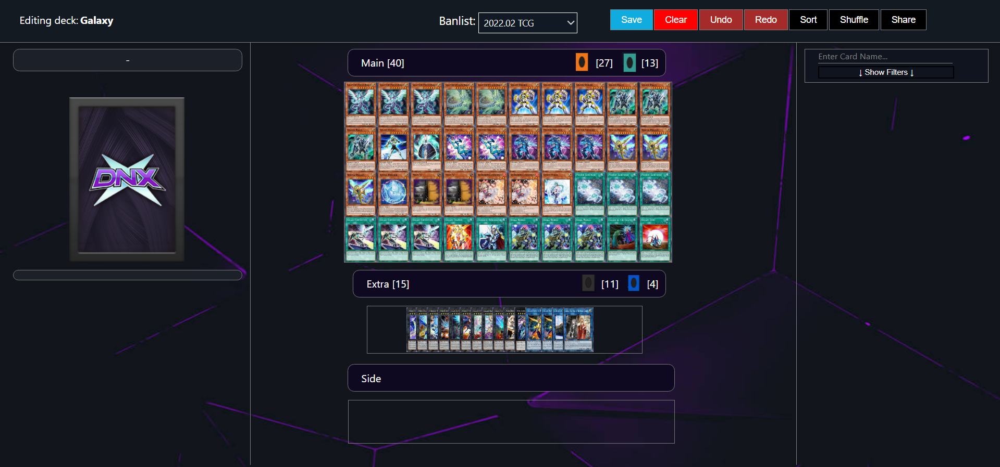

# proyecto_1
En este Proyecto #1 impartido en la Universidad del Valle de Guatemala, en el año 2022, del curso del Sistemas y Tecnologias Web. Se trato de realizar una copia de una pagina al gusto del estudiante utilzando React. Por esta razon la pagina que se llego a implementar es la del [Yu-Gi-Oh Duel links](https://duelingnexus.com/home)

## Pantalla implementada
Para este proyecto implemento una de los decks que yo tengo actualmente en le juego


## Tecnologias utilizadas

### npm


[npm](https://www.npmjs.com/) es el gestor de paquetes para Node.js. Fue creado en 2009 como un proyecto de código abierto para ayudar a los desarrolladores de JavaScript a compartir fácilmente módulos de código empaquetados. Este gestor de paquetes permitió crear el esqueleto principal del proyecto para poder instalar y manejar todas las dependencias implementadas para desarrollar el proyecto.

### webpack


[webpack](https://webpack.js.org/) es un agrupador de módulos estáticos para aplicaciones modernas de JavaScript. Cuando webpack procesa la aplicación, construye internamente un gráfico de dependencias a partir de uno o más puntos de entrada y luego combina cada módulo que dicho proyecto necesita en uno o más paquetes, que son activos estáticos para servir el contenido.

```bash
npm install --save-dev webpack webpack-cli webpack-dev-server
```

### React


[React](https://es.reactjs.org/) es una biblioteca Javascript para crear interfaces de usuario. Es importante mencionar que este framework tiene un enfoque basado en componentes, haciendo que la construcción de una página web sea mucho más fácil ya que permite reutilizar código. Esto permitió que la elaboración de la página de Amazon fuera más fácil, a la vez que proporciona elementos visuales más actualizados y atractivos.

```bash
npm i react react-dom react-router-dom
```

###  Babel


[Babel](https://babeljs.io/) es una cadena de herramientas que se utiliza principalmente para convertir el código ECMAScript 2015+ en una versión de JavaScript compatible con versiones anteriores en navegadores o entornos actuales y antiguos. Este compilador de JavaScript permitió implementar Polyfills para solucionar problemas de ejecución en los diferentes navegadores, al igual que adoptar un formato de código más amigable con las diferentes distribuciones de navegadores que existen en los sistemas de computo hoy en día. También fue necesario instalar el preset para React, lo cual permitiría modificar y darle el formato correcto al código de react.js que fue escrito para el proyecto.

```bash
npm i --save-dev @babel/core @babel/cli @babel/eslint-parser @babel/preset-env @babel/preset-react babel-loader
```

### Sass


[Sass](https://sass-lang.com/) es un lenguaje de hoja de estilos en cascada inicialmente diseñado por Hampton Catlin y desarrollado por Natalie Weizenbaum.​​Después de sus versiones iniciales, Nathan Weizenbaum y Chris Eppstein han continuado extendiendo Sass con SassScript, un lenguaje de script simple, usado en los ficheros Sass

## Resultado Final
Con el uso de todas las tecnologias al final quedo de la siguiente forma
